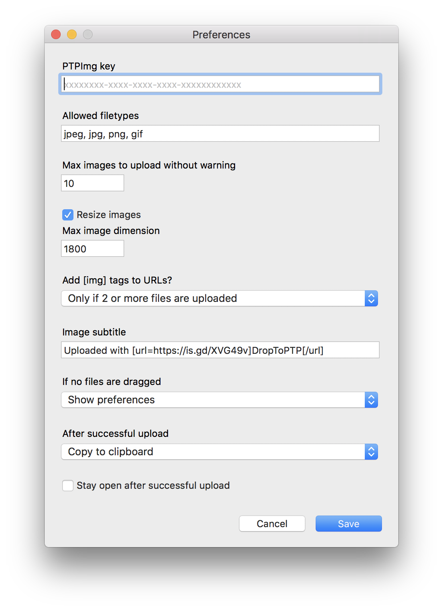

# DropToPTP

**DropToPTP** is a desktop image uploader for macOS.

* **⇩ [Download Latest Version](https://github.com/duckquack/DropToPTP/raw/master/DropToPTP.app.zip)**

## Screenshot

## Notes

Running DropToPTP requires disabling Gatekeeper by running `sudo spctl --master-disable` in the Terminal.

## Changelog

https://github.com/duckquack/DropToPTP/blob/master/CHANGELOG.md

## Building from source

Building DropToPTP requires Platypus and Pashua

* https://github.com/sveinbjornt/Platypus
* https://github.com/BlueM/Pashua